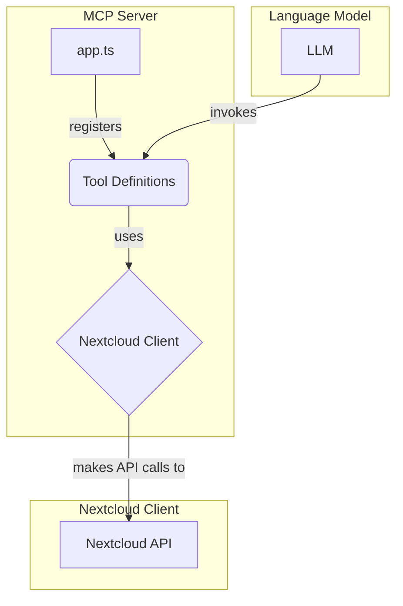
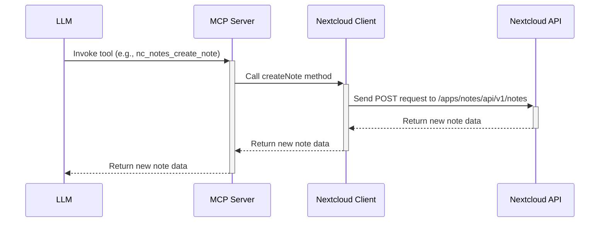

# Nextcloud MCP Server Implementation Plan

This document outlines the plan for creating a new Nextcloud MCP server in TypeScript.

## 1. Project Setup

- **Initialize a new Node.js project:**
  ```bash
  npm init -y
  ```
- **Install TypeScript and necessary type definitions:**
  ```bash
  npm install -D typescript @types/node
  ```
- **Install MCP server library and other dependencies:**
  ```bash
  npm install @modelcontext/server axios
  ```
- **Create a `tsconfig.json` file to configure the TypeScript compiler.**
- **Set up the project structure:**
  ```
  .
  ├── src/
  │   ├── client/
  │   │   ├── base.ts
  │   │   ├── calendar.ts
  │   │   ├── contacts.ts
  │   │   ├── notes.ts
  │   │   ├── tables.ts
  │   │   └── webdav.ts
  │   ├── models/
  │   │   ├── calendar.ts
  │   │   ├── contacts.ts
  │   │   ├── notes.ts
  │   │   └── tables.ts
  │   ├── server/
  │   │   ├── calendar.ts
  │   │   ├── contacts.ts
  │   │   ├── notes.ts
  │   │   ├── tables.ts
  │   │   └── webdav.ts
  │   ├── app.ts
  │   └── config.ts
  ├── .env.sample
  ├── package.json
  └── tsconfig.json
  ```

## 2. High-Level Architecture



## 3. Implementation Details

### 3.1. Base Nextcloud API Client (`src/client/base.ts`)

- Create a `BaseNextcloudClient` class to handle common functionality, such as authentication and request signing.
- Implement a `makeRequest` method to send HTTP requests to the Nextcloud API.
- Use `axios` for making HTTP requests.

### 3.2. API Clients (`src/client/*.ts`)

- Create separate client classes for each Nextcloud app (Notes, Calendar, etc.).
- Each client class will extend the `BaseNextcloudClient` and implement methods for interacting with the specific app's API endpoints.

### 3.3. Tool Definitions (`src/server/*.ts`)

- Create separate files for each set of tools (Notes, Calendar, etc.).
- Use the `@mcp.tool()` decorator to define each tool.
- Each tool will call the corresponding method in the Nextcloud client to perform the requested action.

### 3.4. Main MCP Server (`src/app.ts`)

- Create a new `MCP` server instance.
- Configure the server with the necessary tools and resources.
- Implement a `lifespan` function to manage the `NextcloudClient` lifecycle.

## 4. Workflow



## 5. Next Steps

Once this plan is approved, I will switch to the `code` mode to begin the implementation.