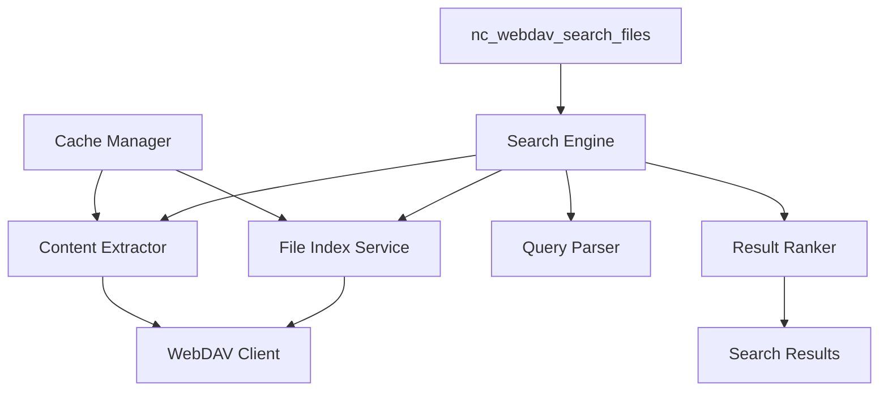

# WebDAV Unified Search Implementation Plan

## Overview

This document outlines the complete implementation plan for adding unified search capabilities to the Nextcloud MCP WebDAV tools, inspired by the approach used in mcp-datagovmy.

## Current State Analysis

### Existing WebDAV Tools
- [`nc_webdav_list_directory`](src/tools/webdav.tools.ts:13) - Lists files in specific directory
- [`nc_webdav_read_file`](src/tools/webdav.tools.ts:32) - Reads specific file content
- [`nc_webdav_write_file`](src/tools/webdav.tools.ts:50) - Writes to specific file path
- [`nc_webdav_create_directory`](src/tools/webdav.tools.ts:74) - Creates directory at specific path
- [`nc_webdav_delete_resource`](src/tools/webdav.tools.ts:95) - Deletes specific resource

### Limitations
- All tools require exact file paths
- No search capabilities across the file system
- No content-based discovery
- Manual navigation required

## Unified Search Architecture

### Core Components



### File Models and Interfaces

#### FileMetadata Interface
```typescript
interface FileMetadata {
  path: string;              // Full path to file
  name: string;              // Filename only
  size: number;              // File size in bytes
  lastModified: Date;        // Last modification date
  mimeType: string;          // MIME type
  extension: string;         // File extension
  isDirectory: boolean;      // Whether it's a directory
  depth: number;            // Directory depth from root
}
```

#### SearchResult Interface
```typescript
interface SearchResult {
  file: FileMetadata;
  matchType: 'filename' | 'content' | 'metadata';
  relevanceScore: number;    // 0-100 relevance score
  contentPreview?: string;   // First few lines if content match
  highlights: string[];      // Matching terms
  context?: string;          // Surrounding context for content matches
}
```

#### SearchOptions Interface
```typescript
interface SearchOptions {
  query: string;                    // Search terms
  searchIn: SearchScope[];          // What to search in
  fileTypes?: string[];             // Filter by extensions
  sizeRange?: { min?: number; max?: number };
  dateRange?: { from?: Date; to?: Date };
  basePath?: string;                // Limit to specific directory
  limit?: number;                   // Max results (default: 50)
  includeContent?: boolean;         // Include content preview
  caseSensitive?: boolean;          // Case sensitive search
}

type SearchScope = 'filename' | 'content' | 'metadata';
```

### Implementation Files Structure

#### 1. Models (`src/models/webdav-search.ts`)
```typescript
// All interfaces and types for the search system
export interface FileMetadata { /* ... */ }
export interface SearchResult { /* ... */ }
export interface SearchOptions { /* ... */ }
export interface FileIndex { /* ... */ }
export interface SearchCache { /* ... */ }

// Enums for file types and search scopes
export enum SupportedFileTypes {
  TEXT = 'text',
  DOCUMENT = 'document', 
  CODE = 'code',
  CONFIG = 'config',
  MEDIA = 'media'
}
```

#### 2. File Indexing Service (`src/utils/file-indexer.ts`)
```typescript
export class FileIndexer {
  private cache = new Map<string, FileIndex>();
  
  /**
   * Recursively index files from a starting path
   */
  async indexDirectory(path: string, maxDepth: number = 10): Promise<FileIndex>
  
  /**
   * Update index for specific path
   */
  async updateIndex(path: string): Promise<void>
  
  /**
   * Get cached index or create new one
   */
  async getIndex(basePath?: string): Promise<FileIndex>
}
```

#### 3. Content Extraction (`src/utils/content-extractor.ts`)
```typescript
export class ContentExtractor {
  /**
   * Extract searchable content from file based on type
   */
  async extractContent(file: FileMetadata): Promise<string>
  
  /**
   * Detect file type and determine extraction strategy
   */
  getFileType(mimeType: string, extension: string): SupportedFileTypes
  
  /**
   * Extract content from text files
   */
  private async extractTextContent(path: string): Promise<string>
  
  /**
   * Extract metadata from binary files
   */
  private async extractBinaryMetadata(path: string): Promise<string>
}
```

#### 4. Search Engine (`src/utils/search-engine.ts`)
```typescript
export class SearchEngine {
  constructor(
    private indexer: FileIndexer,
    private extractor: ContentExtractor
  ) {}
  
  /**
   * Main search method
   */
  async search(options: SearchOptions): Promise<SearchResult[]>
  
  /**
   * Search in filenames
   */
  private searchFilenames(query: string, index: FileIndex): SearchResult[]
  
  /**
   * Search in file content
   */
  private async searchContent(query: string, files: FileMetadata[]): Promise<SearchResult[]>
  
  /**
   * Search in metadata
   */
  private searchMetadata(query: string, index: FileIndex): SearchResult[]
  
  /**
   * Rank and sort results
   */
  private rankResults(results: SearchResult[]): SearchResult[]
}
```

#### 5. Enhanced WebDAV Client (`src/client/webdav.ts` - Extensions)
```typescript
export class WebDAVClient extends BaseNextcloudClient {
  // Existing methods...
  
  /**
   * Recursively list all files from a directory
   */
  public async listDirectoryRecursive(
    path: string, 
    maxDepth: number = 10
  ): Promise<FileMetadata[]>
  
  /**
   * Get detailed file metadata
   */
  public async getFileMetadata(path: string): Promise<FileMetadata>
  
  /**
   * Check if file exists
   */
  public async fileExists(path: string): Promise<boolean>
  
  /**
   * Get file content with size limits for search
   */
  public async readFileForSearch(
    path: string, 
    maxSize: number = 1024 * 1024
  ): Promise<string>
}
```

#### 6. Unified Search Tool (`src/tools/webdav.tools.ts` - New Tool)
```typescript
// Add to registerWebDAVTools function
server.tool(
  prefixToolName('webdav_search_files'),
  'Search for files across Nextcloud using unified search',
  {
    query: z.string().describe('Search terms (supports multiple words)'),
    searchIn: z.array(z.enum(['filename', 'content', 'metadata']))
      .optional()
      .default(['filename', 'content'])
      .describe('What to search in'),
    fileTypes: z.array(z.string())
      .optional()
      .describe('Filter by file extensions (e.g., ["pdf", "txt", "md"])'),
    basePath: z.string()
      .optional()
      .default('/')
      .describe('Limit search to specific directory'),
    limit: z.number()
      .optional()
      .default(50)
      .describe('Maximum number of results'),
    includeContent: z.boolean()
      .optional()
      .default(false)
      .describe('Include content preview in results'),
    caseSensitive: z.boolean()
      .optional()
      .default(false)
      .describe('Case sensitive search')
  },
  async (options) => {
    const searchEngine = new SearchEngine(
      new FileIndexer(),
      new ContentExtractor()
    );
    
    const results = await searchEngine.search(options);
    
    return {
      content: [{
        type: 'text',
        text: JSON.stringify({
          query: options.query,
          totalResults: results.length,
          results: results.map(result => ({
            path: result.file.path,
            name: result.file.name,
            size: result.file.size,
            lastModified: result.file.lastModified,
            matchType: result.matchType,
            relevanceScore: result.relevanceScore,
            ...(options.includeContent && result.contentPreview && {
              contentPreview: result.contentPreview
            }),
            highlights: result.highlights
          }))
        }, null, 2)
      }]
    };
  }
);
```

## Search Features and Capabilities

### 1. Filename Search
- **Exact matches**: "report.pdf" finds "report.pdf"
- **Partial matches**: "report" finds "monthly-report.pdf", "report-2024.docx"
- **Fuzzy matching**: Handle typos and variations
- **Case insensitive**: Default behavior with option to make case-sensitive

### 2. Content Search
- **Text files**: `.txt`, `.md`, `.csv`, `.json`, `.xml`, `.yaml`
- **Code files**: `.js`, `.ts`, `.py`, `.java`, `.html`, `.css`
- **Configuration**: `.conf`, `.ini`, `.properties`
- **Size limits**: Avoid searching very large files (configurable limit)

### 3. Metadata Search
- **File size**: Find files within size ranges
- **Modification date**: Find recently changed files
- **File type**: Filter by MIME type or extension
- **Directory depth**: Find files at specific levels

### 4. Advanced Query Features

#### Query Operators
```
Search Examples:
- "report AND 2024" - Both terms must be present
- "report OR summary" - Either term can be present
- "report NOT draft" - Must contain "report" but not "draft"
- "filename:report" - Search only in filenames
- "ext:pdf" - Find only PDF files
- "size:>1MB" - Find files larger than 1MB
- "modified:>2024-01-01" - Find files modified after date
```

#### Search Scope Modifiers
```
Examples:
- content:"API documentation" - Search only in file content
- filename:"config" - Search only in filenames
- metadata:"large" - Search in metadata (size, dates, etc.)
```

### 5. Result Ranking Algorithm

#### Relevance Scoring (0-100)
1. **Exact filename match**: 100 points
2. **Filename contains query**: 80-95 points (based on position)
3. **Content match frequency**: 50-80 points (based on term frequency)
4. **Metadata match**: 30-60 points
5. **File recency bonus**: Up to +10 points for recent files
6. **File type relevance**: Up to +5 points for text-searchable files

#### Ranking Factors
- **Match position**: Earlier matches score higher
- **Match density**: Multiple term matches in close proximity
- **File size penalty**: Very large files get slight penalty
- **Directory relevance**: Files in common directories get slight bonus

## Performance Optimizations

### 1. Caching Strategy
```typescript
interface CacheConfig {
  indexTTL: number;          // Index cache time-to-live (15 minutes)
  contentTTL: number;        // Content cache TTL (5 minutes) 
  maxIndexSize: number;      // Max files in index cache (10,000)
  maxContentSize: number;    // Max content cache size (100MB)
}
```

### 2. Lazy Loading
- Build index only when first search is performed
- Extract content only for files that match filename/metadata criteria
- Progressive loading for large directories

### 3. Parallel Processing
- Concurrent file listing across multiple directories
- Parallel content extraction for matched files
- Async/await pattern throughout

### 4. Smart Indexing
- Only re-index changed directories
- Hash-based change detection
- Incremental index updates

## Error Handling and Fallbacks

### 1. Connection Issues
- Graceful degradation when WebDAV is unavailable
- Retry logic with exponential backoff
- Clear error messages for users

### 2. Large File Handling
- Skip files larger than configurable limit (default: 10MB)
- Warn when content search is limited due to file size
- Provide metadata-only results for large files

### 3. Permission Issues
- Skip inaccessible files/directories
- Log permission errors without failing entire search
- Provide partial results with warnings

## Usage Examples

### Basic Search
```typescript
// Find all files containing "budget"
await nc_webdav_search_files({
  query: "budget"
});
```

### Advanced Search
```typescript
// Find PDF reports from 2024
await nc_webdav_search_files({
  query: "report 2024",
  fileTypes: ["pdf"],
  searchIn: ["filename", "content"],
  limit: 20,
  includeContent: true
});
```

### Directory-Specific Search
```typescript
// Search only in Documents folder
await nc_webdav_search_files({
  query: "meeting notes",
  basePath: "/Documents",
  searchIn: ["filename", "content"],
  dateRange: {
    from: new Date('2024-01-01'),
    to: new Date()
  }
});
```

## Testing Strategy

### 1. Unit Tests
- Search algorithm accuracy
- Content extraction for different file types
- Cache invalidation logic
- Query parsing

### 2. Integration Tests
- End-to-end search scenarios
- WebDAV API integration
- Large file handling
- Error conditions

### 3. Performance Tests
- Search speed with various index sizes
- Memory usage under load
- Cache effectiveness
- Concurrent search handling

## Migration and Rollout

### 1. Backward Compatibility
- Existing WebDAV tools remain unchanged
- New search tool is additive
- No breaking changes to current API

### 2. Gradual Implementation
- Phase 1: Basic filename search
- Phase 2: Content extraction and search
- Phase 3: Advanced query features and optimization

### 3. Configuration
- Configurable cache sizes and TTLs
- Adjustable search limits
- Optional features can be disabled

## Documentation Updates

### 1. README.md Updates
- Add unified search to tool list
- Include search examples
- Document query syntax

### 2. Tool Documentation
- Comprehensive parameter descriptions
- Usage examples for common scenarios
- Performance considerations and limits

### 3. API Reference
- Complete parameter reference
- Response format documentation
- Error code explanations

## Future Enhancements

### 1. Machine Learning
- Relevance scoring improvement based on user interactions
- Query auto-completion
- Search suggestions

### 2. Additional File Types
- PDF content extraction (when possible)
- Office document metadata
- Image metadata (EXIF data)

### 3. Advanced Features
- Search history and favorites
- Saved search queries
- Search result export

This implementation plan provides a comprehensive foundation for building a unified search system that will dramatically improve the user experience by eliminating the need to specify exact file paths while providing powerful search capabilities across filenames, content, and metadata.